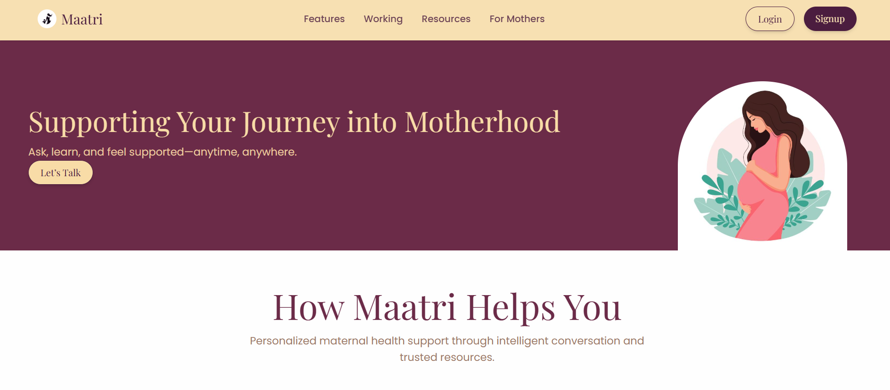
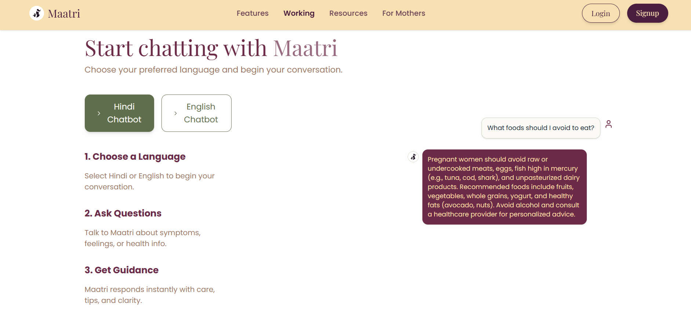
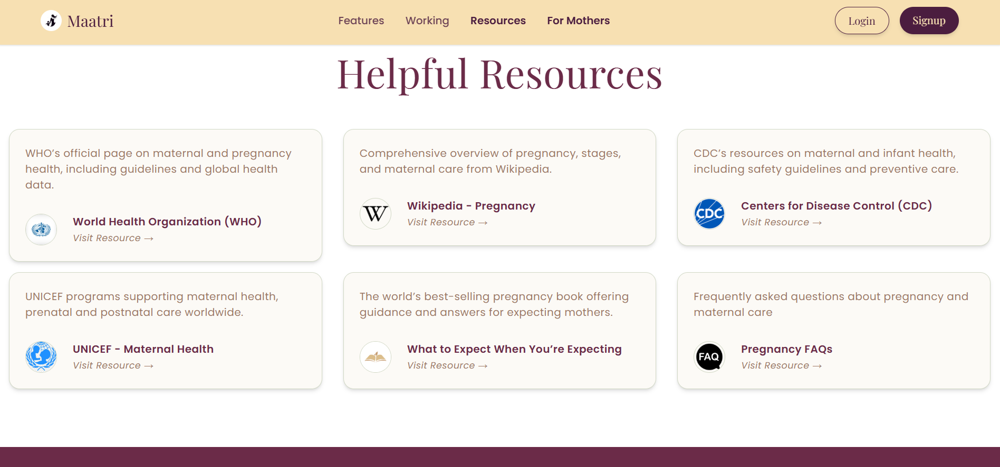
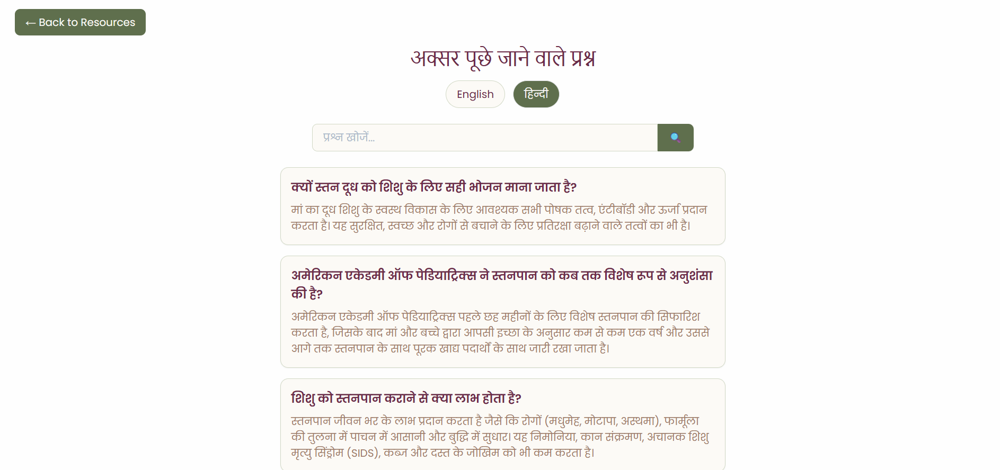
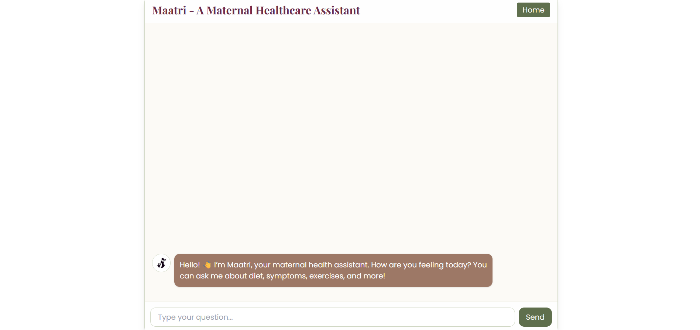
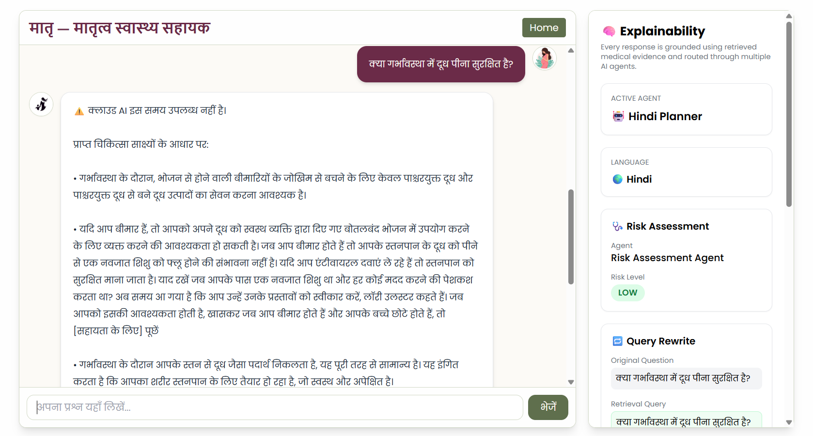
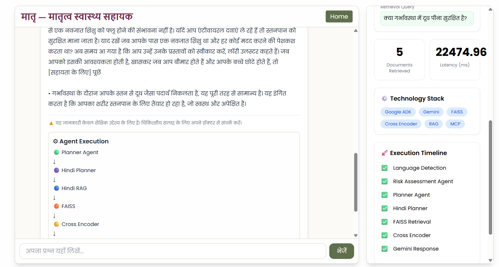

# 🌸 Maatri AI

## Safe Multi-Agent Maternal Healthcare Assistant

Maatri AI is a bilingual (English + Hindi) AI assistant designed to provide safe, grounded, and explainable maternal healthcare guidance. Built using Google's Agent Development Kit (ADK), Retrieval-Augmented Generation (RAG), Gemini, FastAPI, React, and FAISS, it combines multiple specialized AI agents to answer pregnancy-related questions while prioritizing medical safety and transparency.

Instead of relying solely on a large language model, Maatri retrieves relevant medical evidence, reranks it using a Cross Encoder, and generates responses grounded in trusted knowledge sources. Every response includes explainability metadata, source attribution, retrieval statistics, and conversation memory.

---

# Problem Statement

Pregnancy-related health questions are often answered by general-purpose chatbots that may hallucinate, provide unsafe medical advice, or fail to explain where their answers come from.

Maatri AI addresses these challenges by combining:

- Multi-Agent Planning
- Retrieval-Augmented Generation (RAG)
- Explainable AI
- Conversation Memory
- Safety-focused Response Generation
- Bilingual Support (English + Hindi)

The goal is to assist users with educational maternal healthcare information while ensuring that responses remain grounded in retrieved medical evidence.

---

# Features

| Feature | Description |
|----------|-------------|
| Bilingual Support | English and Hindi maternal healthcare assistant |
| Multi-Agent System | Planner routes queries to specialized healthcare agents |
| Conversation Memory | Handles contextual follow-up questions |
| Query Rewriting | Converts conversational follow-ups into standalone questions |
| Hybrid Retrieval | FAISS semantic search with Cross Encoder reranking |
| Evidence Grounding | Responses generated only from retrieved medical evidence |
| Risk Assessment | Detects potentially dangerous pregnancy symptoms |
| Medical Safety | Safety-first prompting with medical disclaimers |
| Source Attribution | Shows retrieved evidence used for every response |
| Explainability Panel | Visualizes routing, retrieval, latency, and reasoning |
| Local Fallback | Local summarization when cloud LLMs are unavailable |

---

# System Architecture

```
                    User
                      │
                      ▼
              React Frontend
                      │
                      ▼
              FastAPI Backend
                      │
                      ▼
              Planner Agent (ADK)
        ┌─────────────┼─────────────┐
        │             │             │
        ▼             ▼             ▼
 Language      Risk Assessment   Intent Detection
 Detection          Agent             Agent
        │
        ▼
  English / Hindi Agent
        │
        ▼
 Conversation Memory
        │
        ▼
 Query Rewriter
        │
        ▼
 Sentence Embeddings
        │
        ▼
 FAISS Vector Search
        │
        ▼
 Cross Encoder Reranker
        │
        ▼
 Gemini Generator
        │
        ├──────────────► Local BART Summarizer
        │
        └──────────────► Evidence Synthesizer
        │
        ▼
 Grounded Response
        │
        ▼
 Explainability Panel
```

---

# Multi-Agent Workflow

## Planner Agent

Responsible for orchestrating the complete workflow.

Responsibilities:

- Detect language
- Assess medical risk
- Detect user intent
- Route to the correct healthcare agent

---

## Health Agent

Handles general pregnancy-related questions.

Examples:

- Morning sickness
- Fever
- Swollen feet
- Exercise
- Medication

---

## Nutrition Agent

Answers maternal nutrition questions.

Examples:

- Fruits
- Iron-rich foods
- Coffee
- Milk
- Protein
- Vitamins

---

## Emergency Agent

Detects potentially dangerous symptoms and prioritizes medical safety.

Examples:

- Heavy bleeding
- Severe abdominal pain
- High fever
- Loss of fetal movement

---

# Retrieval-Augmented Generation Pipeline

Every response follows the pipeline below.

```
User Question
      │
      ▼
Conversation Memory
      │
      ▼
Query Rewriting
      │
      ▼
Embedding Generation
      │
      ▼
FAISS Retrieval
      │
      ▼
Cross Encoder Re-ranking
      │
      ▼
Top Medical Evidence
      │
      ▼
Gemini Generation
      │
      ▼
Local BART Fallback
      │
      ▼
Evidence Synthesizer
      │
      ▼
Final Response
```

---

# Explainability

Unlike traditional chatbots, Maatri exposes its reasoning pipeline.

For every answer the system provides:

- Active AI Agent
- Language
- Risk Assessment
- Query Rewrite
- Retrieved Documents
- Source Distribution
- Retrieval Latency
- Generator Used
- Conversation Memory
- Execution Timeline

This enables users to understand how every answer was produced.

---

# Tech Stack

## Backend

- Python
- FastAPI
- Google ADK
- Gemini 2.5 Flash
- MCP (Model Context Protocol)
- FAISS
- Sentence Transformers
- Cross Encoder
- LangDetect

---

## Frontend

- React
- Vite
- TailwindCSS

---

## AI Models

### English

- multi-qa-mpnet-base-dot-v1
- Fine-tuned Cross Encoder
- Gemini 2.5 Flash

### Hindi

- multilingual-e5-base
- mMiniLM Cross Encoder
- Gemini 2.5 Flash

### Local Fallback

- DistilBART CNN Summarizer

---

# Repository Structure

```
Maatri-AI
│
├── backend
│   ├── agents
│   ├── api
│   ├── english_rag
│   ├── hindi_rag
│   ├── llm
│   ├── routing
│   ├── memory
│   ├── mcp
│   └── utils
│
├── frontend
│   ├── src
│   ├── components
│   └── assets
│
├── architecture.md
├── README.md
└── docker-compose.yml
```

---

# Running Locally

## Clone Repository

```bash
git clone https://github.com/Chaitanya-Wanjari/Maatri-AI.git

cd Maatri-AI
```

---

## Backend

```bash
cd backend

pip install -r requirements.txt

uvicorn backend.main:app --reload
```

Backend will run at

```
http://localhost:8000
```

---

## Frontend

```bash
cd frontend

npm install

npm run dev
```

Frontend will run at

```
http://localhost:5173
```

---

# Environment Variables

Create a `.env` file inside the backend directory.

```
GEMINI_API_KEY=YOUR_API_KEY

LLM_PROVIDER=gemini
```

---

# Example Questions

## English

- Is fever dangerous during pregnancy?
- Can I drink coffee while pregnant?
- Why are my feet swollen?
- Which fruits are safe during pregnancy?
- Can I exercise during pregnancy?

---

## Hindi

- गर्भावस्था में कौन से फल अच्छे हैं?
- क्या मैं कॉफी पी सकती हूँ?
- क्या बुखार खतरनाक है?
- मेरे पैरों में सूजन क्यों है?
- आयरन की कमी कैसे पूरी करें?

---

# Screenshots

## Home Page



---
## Bilingual Support


---
## Resorces for Users

---

## FAQs Search


## English Conversation



---

## Hindi Conversation



---

## Explainability Panel



---


# Future Improvements

- Voice-based interaction
- Doctor appointment integration
- Medical citation ranking
- Pregnancy timeline personalization
- Electronic Health Record integration
- Wearable device support
- Cloud deployment on Google Cloud
- Expanded multilingual support
- Offline mobile application

---

# Disclaimer

Maatri AI is intended solely for educational and informational purposes.

It is **not** a substitute for professional medical advice, diagnosis, or treatment. Users should always consult a qualified healthcare provider regarding medical concerns.

---

# Acknowledgements

This project was developed as part of the **Kaggle AI Agents: Intensive Vibe Coding Capstone** using concepts including:

- Google Agent Development Kit (ADK)
- Model Context Protocol (MCP)
- Retrieval-Augmented Generation (RAG)
- Multi-Agent Systems
- Explainable AI

---

# License

This project is released under the MIT License.
