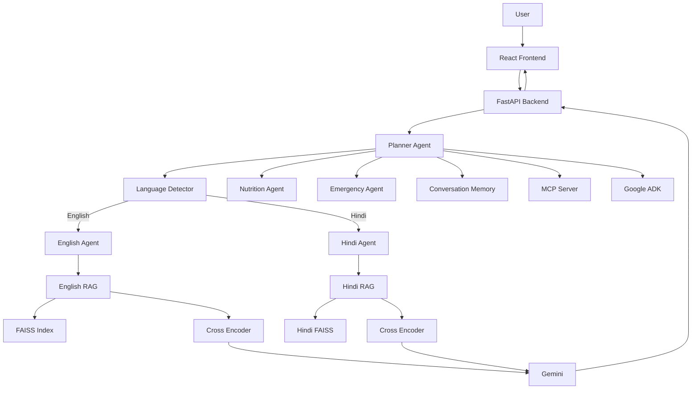

# Maatri AI Architecture

```mermaid
flowchart TD

U[User]

U --> FE[React Frontend]

FE --> API[FastAPI Backend]

API --> Planner[Planner Agent]

Planner --> Lang[Language Detector]

Lang -->|English| EN[English Agent]

Lang -->|Hindi| HI[Hindi Agent]

Planner --> Nutrition[Nutrition Agent]

Planner --> Emergency[Emergency Agent]

EN --> ENRAG[English RAG]

HI --> HIRAG[Hindi RAG]

ENRAG --> FAISS1[FAISS Index]

HIRAG --> FAISS2[Hindi FAISS]

ENRAG --> CE1[Cross Encoder]

HIRAG --> CE2[Cross Encoder]

CE1 --> Gemini[Gemini]

CE2 --> Gemini

Planner --> Memory[Conversation Memory]

Planner --> MCP[MCP Server]

Planner --> ADK[Google ADK]

Gemini --> API

API --> FE
```