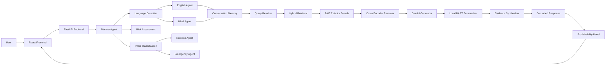
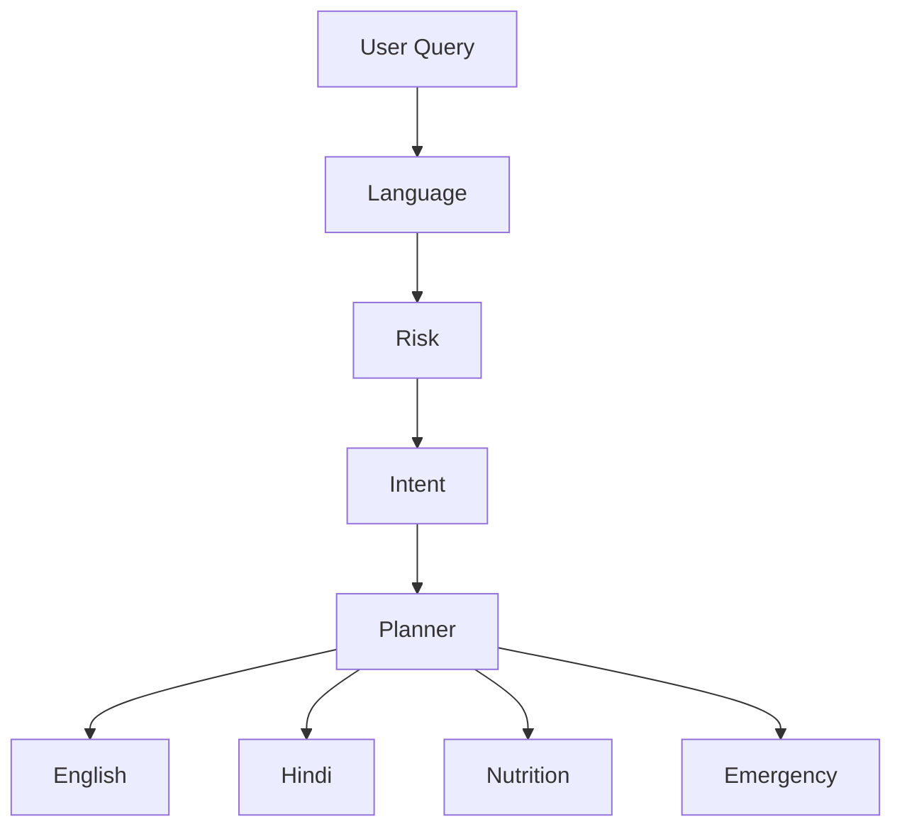
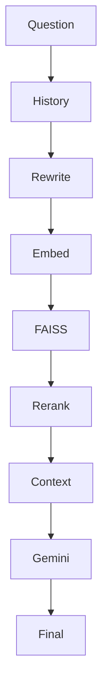
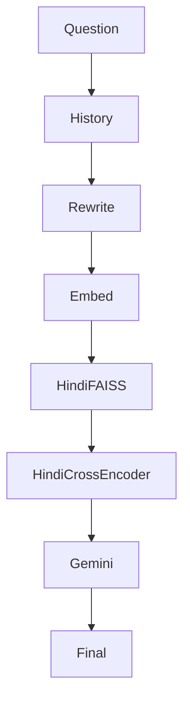
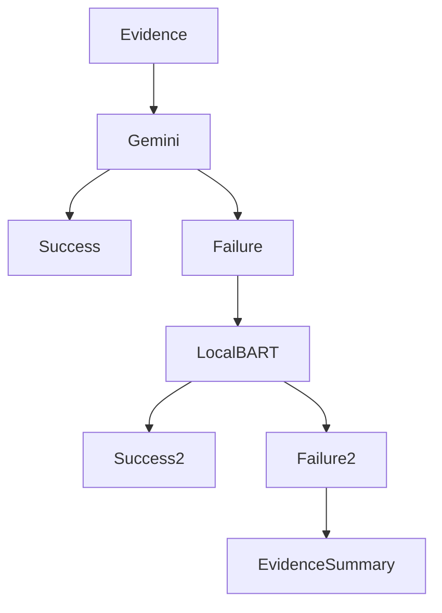
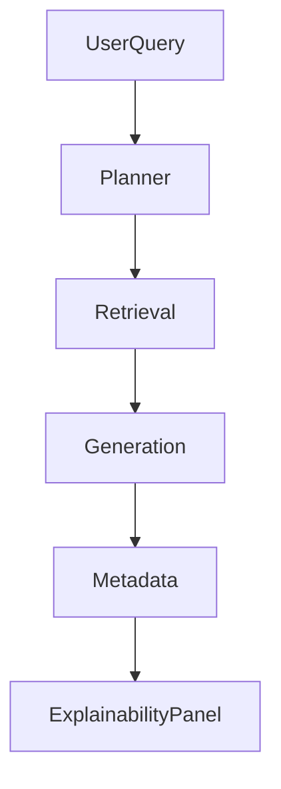

# Maatri AI Architecture

Maatri AI is a bilingual, multi-agent maternal healthcare assistant built using Google Agent Development Kit (ADK), Retrieval-Augmented Generation (RAG), FastAPI, React, and Gemini.

The system follows a modular architecture where specialized agents collaborate to provide safe, grounded, and explainable healthcare responses.

---

# Overall System Architecture

---

# Planner Workflow

The Planner Agent orchestrates the entire system.

---

# English RAG Pipeline

---

# Hindi RAG Pipeline

---

# Generation Pipeline

The system prioritizes cloud-based generation while providing graceful degradation when cloud APIs are unavailable.

---

# Explainability Pipeline

Every answer returned by Maatri includes execution metadata.

The Explainability Panel displays:

- Active Agent
- Language
- Risk Assessment
- Query Rewrite
- Retrieved Documents
- Source Distribution
- Retrieval Latency
- Generator Used
- Conversation Memory
- Execution Timeline

---

# Agent Responsibilities

## Planner Agent

Responsible for coordinating the complete workflow.

Responsibilities:

- Language Detection
- Risk Assessment
- Intent Classification
- Agent Routing

---

## Health Agent

Handles general pregnancy-related health queries.

Examples:

- Morning sickness
- Fever
- Swollen feet
- Exercise
- Medication

---

## Nutrition Agent

Specializes in maternal nutrition.

Examples:

- Fruits
- Vegetables
- Protein
- Iron
- Calcium
- Coffee
- Milk

---

## Emergency Agent

Detects high-risk maternal conditions requiring urgent attention.

Examples:

- Heavy bleeding
- Severe abdominal pain
- High fever
- Reduced fetal movement

---

# Retrieval Strategy

The retrieval pipeline combines dense semantic search with neural reranking.

1. Query rewriting using conversation history.
2. Sentence embedding generation.
3. FAISS semantic retrieval.
4. Cross Encoder reranking.
5. Top-k evidence selection.
6. Grounded response generation.

---

# Safety Mechanisms

Maatri incorporates multiple safety layers.

- Grounded Retrieval-Augmented Generation
- Medical evidence only
- Risk assessment agent
- Safety-focused prompting
- Conversation memory
- Source attribution
- Medical disclaimer
- Local fallback summarization
- Explainability metadata

---

# Technology Stack

| Layer | Technology |
|--------|------------|
| Frontend | React + Vite + TailwindCSS |
| Backend | FastAPI |
| Multi-Agent | Google ADK |
| LLM | Gemini 2.5 Flash |
| Retrieval | FAISS |
| Embeddings | Sentence Transformers |
| Reranking | Cross Encoder |
| Memory | Session-based Conversation Store |
| Explainability | Custom Metadata Pipeline |
| Fallback | DistilBART Summarizer |
| Protocol | Model Context Protocol (MCP) |